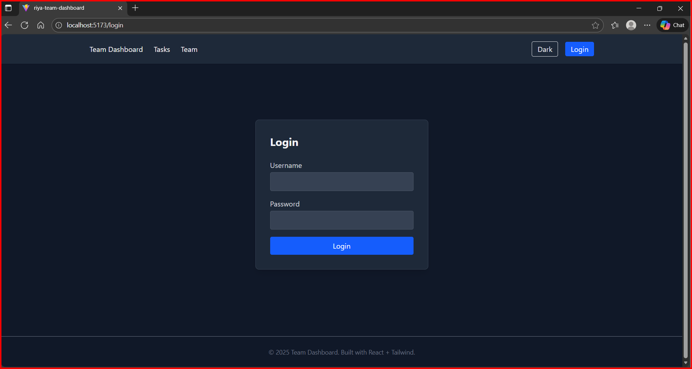
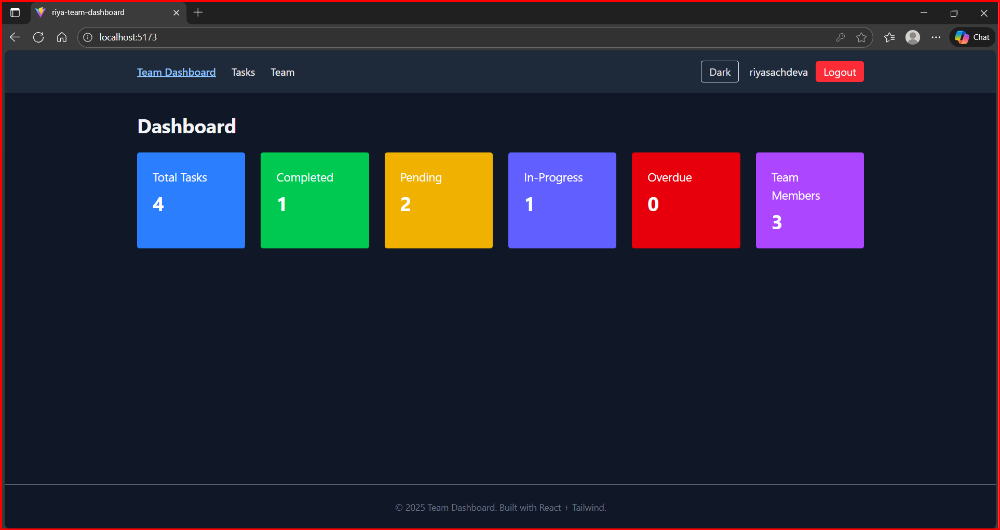
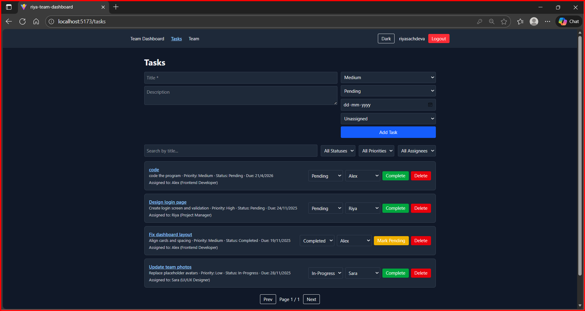
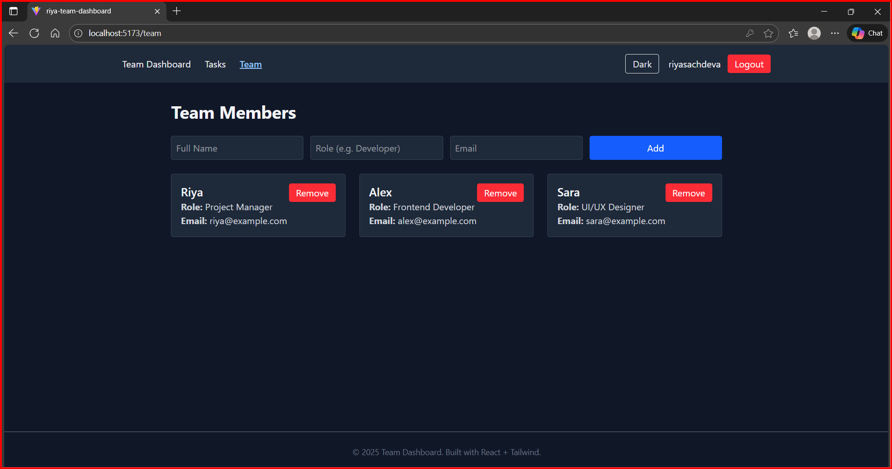

```md
#  Riya Dashboard Alea  
A modern **React + Vite + Tailwind CSS** project for team management and dashboards.

---

##  Tech Stack
- **React**
- **Vite**
- **Tailwind CSS (latest)**
- **PostCSS / Autoprefixer**
- **Basic Routing / State Management**

---

##  Features
- Dashboard home page showing overview metrics  
- Task list with filters & search  
- Task details view  
- Team members page  
- Responsive layout  
- Tailwind-based UI for fast, clean styling  

---

##  Folder Structure
```

riya-dashboard-alea/

├── public/

├── src/

│   ├── assets/

│   ├── components/

│   ├── pages/

│   ├── App.jsx

│   ├── main.jsx

│   └── index.css

├── package.json

├── tailwind.config.cjs

├── postcss.config.cjs

└── vite.config.js


### 1. Clone the repository
```sh
git clone https://github.com/riyasachdeva1/riya-dashboard-alea.git
cd riya-dashboard-alea
````

### 2. Install dependencies

```sh
npm install
```

### 3. Run the development server

```sh
npm run dev
```

---

##  Tailwind CSS Setup

### Installed using:

```sh
npm install -D tailwindcss postcss autoprefixer
npx tailwindcss init -p
```

### `tailwind.config.cjs` includes:

```js
export default {
  content: [
    "./index.html",
    "./src/**/*.{js,jsx,ts,tsx}"
  ],
  theme: {
    extend: {},
  },
  plugins: [],
}
```

### `src/index.css` contains:

```css
@tailwind base;
@tailwind components;
@tailwind utilities;
```

---

##  Screenshots

###  Login Page

```

```

###  Dashboard Home

```

```

###  Task List Page

```

```


###  Team Members Page

```

```

---

## Future Enhancements

* Dark mode toggle
* Real backend integration (REST / GraphQL)
* Drag & drop task management
* User roles & permissions
* Export reports

---

##  Author

**Riya Sachdeva**


